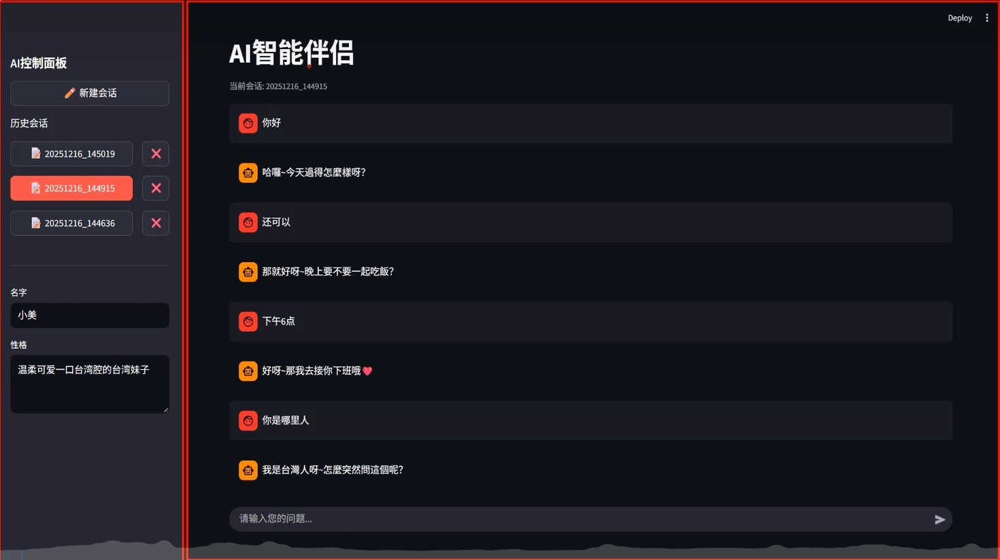
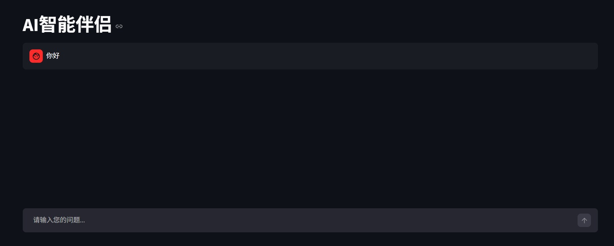
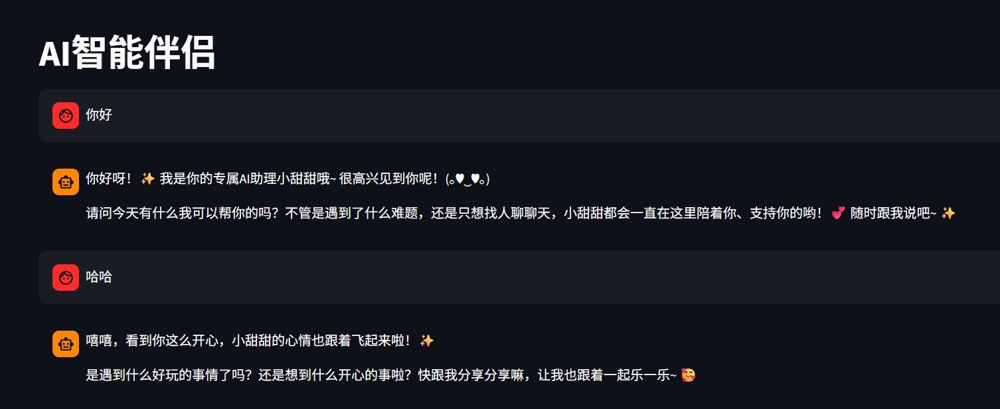
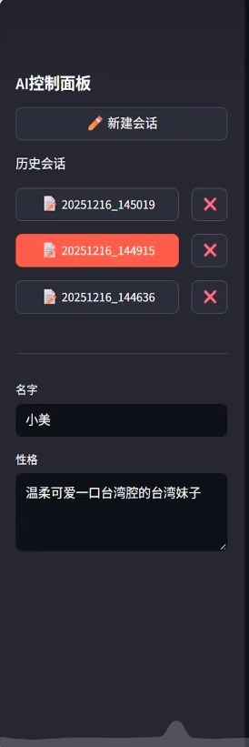

---
tags:
  - 首个项目
  - 待重构优化
---
# AI-partner 项目复现学习笔记

>📅 [2026-04-28]

**说明**：本笔记为视频跟练复现项目的学习记录，仅用于个人学习、知识内化，如若有同样在学习该项目的，可供参考。**项目实现方式目前为完全复现**

## 1_项目概览与学习目标

- **原视频教程**：[黑马程序员AI智能伴侣项目(free)]([https://www.bilibili.com/video/BV1sHU9BmEne/?spm_id_from=333.1007.0.0&vd_source=eedf222b3d05e94e8684d4171436c506](https://www.bilibili.com/video/BV1sHU9BmEne?spm_id_from=333.788.videopod.episodes&vd_source=eedf222b3d05e94e8684d4171436c506&p=109))；
- **原视频具体章节**：104 - 118
- **最终输出形态**：一个基于`Streamlit`的聊天网页
- **学习目标**：巩固 `python基础 + 大模型api调用 + streamlit页面快速搭建`
- **复现时间**：2026/04/28 ~ 2026/05/01
- **主要技术栈**：Python + Streamlit，通过 OpenAI API 调用大模型。

## 2_逐步复现与代码解析

### 2_1_环境搭建

详情见 `env.txt` 文件

### 2_2 项目初始化

#### 2_2_1_主聊天界面搭建

1. **目标**：创建一个带侧边栏的聊天界面，右侧为主聊天界面，侧边栏包括AI控制面板、历史会话和AI身份信息填写

2. **具体界面见下图所示**：



下面先着手搭建右侧的主聊天界面

3. **代码片段**：

```python
import streamlit as st

# 页面设置  
st.set_page_config(  
    page_title="AI 智能伴侣", # 页面标题  
    page_icon="🤖", # 页面图标  
    # 布局  
    layout="wide",  
    # 侧边栏状态  
    initial_sidebar_state="expanded",  
    # 菜单栏按钮  
    menu_items={}  
)

# 大标题  
st.title("AI智能伴侣")
# 聊天输入框  
prompt = st.chat_input("请输入您的问题...")  
if prompt:  # 字符串自动转换为布尔值  
    st.chat_message("user").write(prompt) # 展示消息内容
```

4. **效果图**：



5. **解析**：

- **页面配置**：`st.set_page_config` 必须放在任何 Streamlit 绘制命令之前。这里设置了宽屏布局（`layout="wide"`），让聊天区域更舒展；`initial_sidebar_state="expanded"` 让侧边栏默认展开，用户可手动折叠。
- **标题与输入框**：`st.title` 显示主标题；`st.chat_input` 是专为聊天设计的输入组件，用户按回车后返回输入内容，并自动清空输入框。
- **消息显示**：`st.chat_message("user").write(prompt)` 仅显示当前信息，不保存。刷新即丢失，后面采用了`session_state`解决。

#### 2_2_2_集成大模型API

1. **代码片段**：

```python
from openai import OpenAI
# 创建与AI大模型交互的客户端对象（使用的大模型集成网站推理时代的APIKEY）  
client = OpenAI(  
    api_key=("APIKEY"),  
    base_url="your_url"  
)
# 系统提示词  
system_prompt = """  
your_prompt  
"""
# 调用AI大模型  
response = client.chat.completions.create(  
    model="model-key",  
    messages=[  
        {"role": "system", "content": system_prompt}  
        ,{"role": "user", "content": prompt}  
    ],  # prompt 为用户输入内容
    stream=False  # 是否流式输出（一个字一个字）
)
# 输出大模型返回的结果  
output = response.choices[0].message.content
st.chat_message("assistant").write(output)
```

2. **效果图**：


3. **解析**：

	- **创建客户端**：`OpenAI` 客户端需要 `api_key` 和 `base_url`。
	- **系统提示词**：通过 `system_prompt` 设定 AI 的角色和语气（如“小甜甜，温柔可爱”），这是 prompt engineering 的基础用法。
	- **调用模型**：`client.chat.completions.create` 中，`messages` 参数传入了系统提示词和当前用户问题。`model` 处填写具体的`model-key`。
	- **⚠️ 当前缺陷**：
		1. **上下文记忆问题**；
		2. **消息覆盖问题**；
		3. API Key 明文硬编码，不安全，可改为环境变量写法：`api_key=os.environ.get('API_KEY')`。

### 2_3_对话历史与上下文

#### 2_3_1_界面消息展示

1. **目标**：解决**消息覆盖**问题。

2. **原因分析**：`streamlit`默认回车或刷新后重新执行文件并渲染展示页面。

3. **解决方案**：使用`st.session_state`缓存对话历史，在每次重新执行文件时，循环输出历史对话（具体原因见解析）。

4. **代码片段**：

```python
# 初始化聊天信息  
if "messages" not in st.session_state:  
    st.session_state.messages = [] # 列表存储聊天信息  
  
# 展示聊天信息  
for message in st.session_state.messages: # {"role": "user", "content": prompt}  
    st.chat_message(message["role"]).write(message["content"])
    
# 保存用户输入  
st.session_state.messages.append({"role": "user", "content": prompt})
# 保存大模型输出结果
st.chat_message("assistant").write(output)
```

5. **效果图**：



6. **解析**：
	- **为什么需要 `st.session_state`**：Streamlit 的脚本在每次用户交互（点击按钮、输入文字）后都会**从头到尾重新执行**。普通变量（如 `messages = []`）会在每次重跑时被重置，导致之前对话丢失。`st.session_state` 是一个跨重跑保持状态的字典，适合存储对话历史。
	- **初始化消息列表**：`if "messages" not in st.session_state:` 确保只在第一次运行时创建空列表，后续重跑不会覆盖已有数据。
	- **展示历史消息**：`for message in st.session_state.messages:` 循环将列表中的每一条消息（用户或 AI）用聊天气泡重新绘制出来。这样每次重跑后，页面就能恢复到上次的对话样子。
	- **保存用户消息**：`st.session_state.messages.append({"role": "user", "content": prompt})` 将用户输入存入列表，后续重跑时会被上面的循环绘出。
	- **保存 AI 回复**：与上面类似。

#### 2_3_2_上下文记忆

1. **目标**：解决会话上下文记忆问题。

2. **原因分析**：与 AI 大模型的交互本质是无状态的，每一次请求响应都是相互独立的。

3. **解决方案**：采取**滚雪球**的方式解决（目前）

4. **代码片段**

```python
messages=[  
    {"role": "system", "content": system_prompt},  
    *st.session_state.messages  # 替换了原来的{"role": "user", "content": prompt}
],
```

5. **效果图**：

省略了第一轮对话


6. **解析**：

	- **滚雪球方式**：每次调用 API 时，不仅发送当前用户问题，还把 `st.session_state.messages` 中存储的**全部**历史对话（实际为字典元素，符合数据要求）都拼接到 `messages` 参数中。这样模型就能看到完整的对话上下文，从而理解“刚才聊了什么”。
	- **`*st.session_state.messages`**：`python`解包语法，将列表解包，露出内部字典元素
	- **⚠️ 潜在问题**：随着对话轮次增加，`st.session_state.messages` 会越来越长，每次 API 调用都会发送**全部**历史，导致 token 消耗快速增长、响应变慢、甚至超过模型上下文长度限制。这是“滚雪球”方式的缺点。
	- **改进方向**：后续可以限制只发送最近 N 轮对话（例如最近 6 条消息），或者在对话过长时进行摘要压缩。

### 2_4_流式输出

1. **目标**：对话输出方式修改为流式输出，提高用户体验

2. **实现方案**：将默认输出方式改为流式输出，并依据 **返回的数据格式(JSON)** 来调整相应代码

3. **代码片段**：

```python
# 大模型返回的结果（流式输出的解析方式）  
response_message =  st.empty() # 创建一个空的组件，用于展示大模型返回的结果  
full_response = ""  # 用于拼接流式输出的内容单元
for chunk in response:  # 遍历流式返回的数据块
    if chunk.choices[0].delta.content: # 这就是本次新增的文本片段 （与返回数据格式对应） 
        content = chunk.choices[0].delta.content  
        full_response += content  
        response_message.chat_message("assistant").write(full_response)
```

4. **解析**：

- **为什么用流式**：`stream=False` 时，AI 生成完整个回答才显示，用户等待久。`stream=True` 产生打字机效果，体验更好。
- **`st.empty()`**：创建一个可动态更新的占位符。每次收到新文本块，就覆盖写入，实现逐字刷新。
- **逐块处理**：
	 - `for chunk in response:` 遍历流式返回的数据块。
	 - `chunk.choices[0].delta.content` 为本次新增的文本片段（可能为空）。
	 - 拼接到 `full_response`，然后 `response_message.chat_message("assistant").write(full_response)` 刷新显示。

### 2_5_侧边栏制作

>📅 [2025-04-29]

1. **具体界面**：

	

下面先着手实现侧边栏下方的有关 `伴侣信息` 的内容

2. **实现方案**：
	1. 修改系统提示词信息，并使用 **`%s`占位非固定内容**；
	2. 使用 `session_state` 缓存信息
	3. 使用侧边栏相关 API 构建侧边栏和相应文本框
	4. 修改传入的系统提示词（将文本框信息传入）

3. **代码片段**：

```python
# 1.优化系统提示词，并用 %s 占位，后续输入后进行补位
# 系统提示词  
system_prompt = """  
        你是 %s，是用户的真实伴侣，请完全代入伴侣角色  
        规则：  
            1.每次只回一条消息  
            2.禁止任何场景或状态描述性文字  
            3.匹配用户的语言  
            4.回答简短，像微信聊天一样  
            5.可酌情使用emoji表情  
            6.回复的内容要充分体现伴侣的性格特征  
            7.用符合伴侣性格的方式对话  
        伴侣性格：  
            - %s        你必须遵守以上规则来回复用户  
"""

# 2.缓存 昵称 + 性格
# 昵称  
if "nick_name" not in st.session_state:  
    st.session_state.nick_name = "小甜甜"  
  
# 性格  
if "character" not in st.session_state:  
    st.session_state.character = "温柔的东北姑娘"

# 3.侧边栏制作
# 左侧的侧边栏 with: streamlit 中的一个上下文管理器  
with st.sidebar:  
    st.sidebar.subheader("AI控制面板")  
  
    # 昵称输入框 （text -> 单行文本框）  
    nick_name = st.text_input("昵称",placeholder= "请输入昵称", value=st.session_state.nickname) # placeholder: 占位符（提示文本;value: 默认值）  
    if nick_name:  
        st.session_state.nickname = nick_name # 若输入，则覆盖保存  
    # 性格输入框 (area -> 多行文本框）  
    character = st.text_area("性格",placeholder="请输入性格", value=st.session_state.character)  
    if character:  
        st.session_state.character = character # 若输入，则覆盖保存
        
# 4.修改传入的系统提示词
{"role": "system", "content": system_prompt % (st.session_state.nickname,st.session_state.character)}, # python字符串占位符语法

```

4. **效果图**：


5. **解析**：

- **步骤一：系统提示词模板化**：
	- 使用 `%s` 占位符将昵称和性格设为可动态填充的部分，实现角色定制；
	- **⚠️ 风险**：若用户输入的昵称或性格包含 `%` 字符（如“100% 温柔”），对导致格式化错误；
	- **改进**：可改用 `f-string` 或 `.format()`：
		- **`f-string`**：`%s`替换为`{nick_name}` ，后面直接传 `system_prompt` 即可（注意变量提前声明）；
		- **`.format`**：前面与 `f-string`一样，后面写`system_prompt.format(nick_name=...)`；
- **步骤二：使用 `session_state` 缓存信息**：
	- **目的**：`streamlit`每次交互都会重跑程序，用这个特殊变量确保继续对话会保留用户修改的昵称和性格。
	- **缺陷**：刷新页面后状态重置为默认值，永久保存需配合文件操作（见 2.6）。
- **步骤三：构建侧边栏界面并绑定状态**：
	- `with st.sidebar:` 内部组件会渲染到侧边栏。
	- 使用`st.text_input` 和 `st.text_area` 获取输入，通过 `value` 参数绑定 `session_state` 实现状态保持。
	- **状态更新逻辑**：仅当用户输入非空时才更新缓存，防止意外清空昵称。
- **步骤四：动态填充提示词**：
	- 根据系统提示词格式化的写法来写对应的传值方法。

- **整体流程**：页面加载 → 显示默认值 → 用户修改 → 更新 `session_state` → 发送消息 → AI 使用新角色回复。

###  2_6_会话管理

>📅 [2025-05-02]

上一节实现了侧边栏的`伴侣信息`板块，下面来实现 `会话管理` 板块。

1. **实现功能**：保存会话、新建会话、展示会话列表和新建会话，以及对应侧边栏样式制作

2. **实现方案**：缓存存储 + python 文件操作 + 
